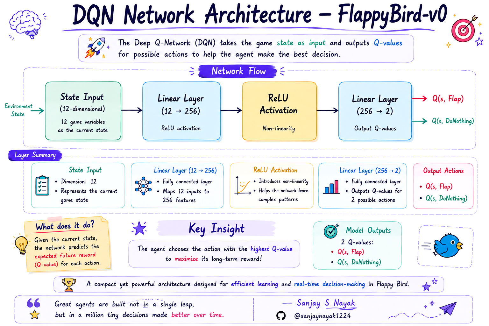
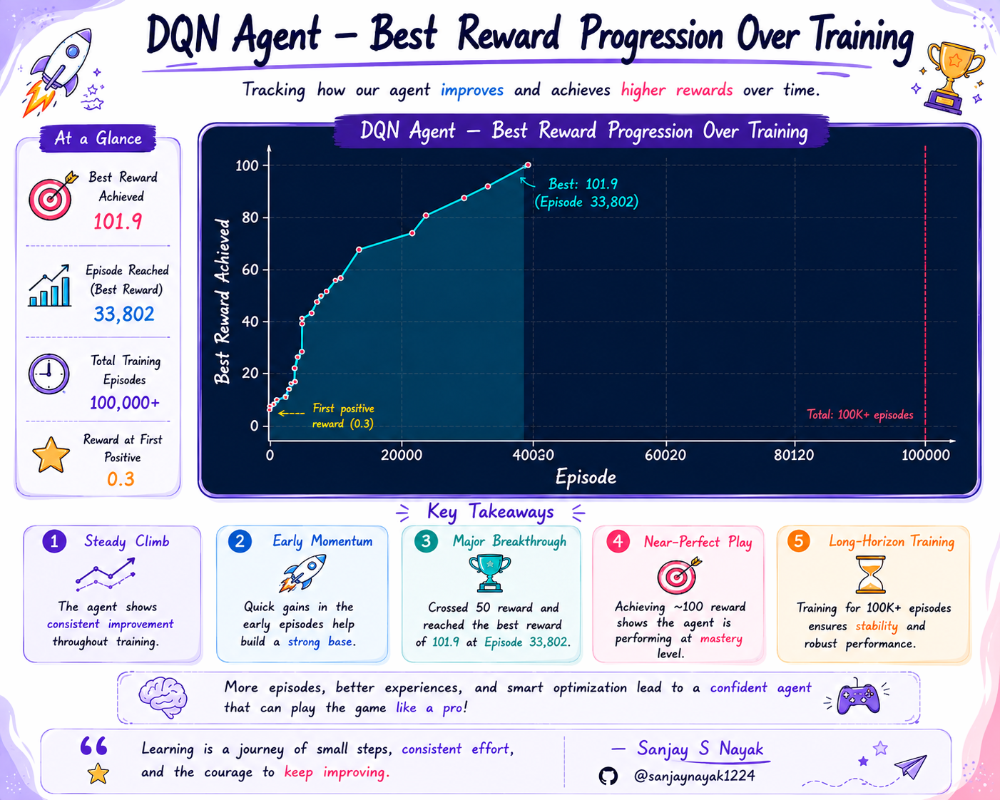
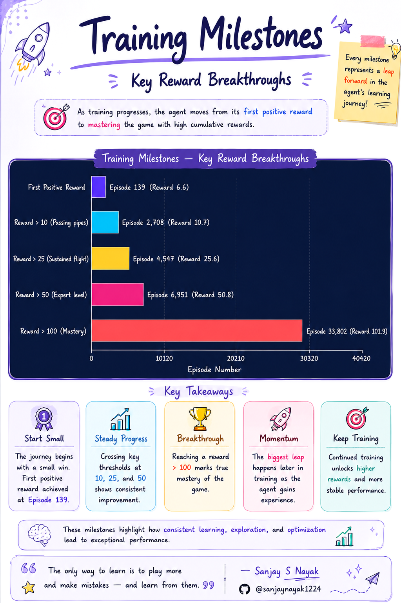

# 🐦 FlappyBird: Deep Q-Network (DQN) Reinforcement Learning

[](https://www.python.org/)
[](https://pytorch.org/)
[](https://gymnasium.farama.org/)
[](https://developer.nvidia.com/cuda-toolkit)
[](https://opensource.org/licenses/MIT)

I built a Deep Q-Network agent from scratch to learn Flappy Bird using GPU-accelerated experience replay, target network stabilization, and epsilon-greedy exploration — trained over **100,000+ episodes** on the `FlappyBird-v0` Gymnasium environment.

The agent started with zero knowledge of the game, and through iterative optimization of the training pipeline, **I achieved a best cumulative reward of 101.9** in a single episode.

---

## 📌 Key Results

- **Best Reward**: `101.9` cumulative reward at episode 33,802 — sustained flight across dozens of pipes in a single run.
- **First Positive Reward**: Episode 139 — the agent learned to survive past its first pipe within minutes of training.
- **Training Scale**: 100,000+ episodes of continuous self-play, totaling millions of environment steps.
- **Convergence Speed**: After optimization, the agent hits expert-level performance (50+ reward) within ~7,000 episodes.

---

## 📌 Environment & State Space

**FlappyBird-v0** is a continuous-control Gymnasium environment where the bird must navigate through an endless sequence of pipe gaps by choosing to `flap` or `idle` at each timestep.

### State Representation (12-dim Numerical Vector)

I deliberately **disabled** LIDAR (`use_lidar=False`) to reduce the default 180-dimensional observation space down to a concise **12-dimensional vector**, enabling rapid convergence with a small MLP instead of requiring convolutional architectures.

| Feature Group  | Dimensions | Description                                        |
| :------------- | :--------: | :------------------------------------------------- |
| Bird State     |     3      | Vertical position, velocity, rotation              |
| Next Pipe      |     4      | Top/bottom pipe coordinates for the upcoming gap   |
| Following Pipe |     4      | Top/bottom pipe coordinates for the gap after next |
| Score Info     |     1      | Player score (passed pipes count)                  |

### Action Space & Rewards

| Action | ID  | Effect                             |
| :----- | :-: | :--------------------------------- |
| Idle   | `0` | No flap — bird falls under gravity |
| Flap   | `1` | Upward impulse                     |

- **+0.1** per frame survived
- **+1.0** for passing through a pipe gap
- **-1.0** on collision with pipes or ground
- **-0.5** on collision with ceiling

---

## 🧠 DQN Architecture & Design

<p align="center">
  
</p>

I kept the architecture intentionally minimal — a 2-layer MLP with a single hidden layer of 256 neurons. No convolutional layers, no LSTMs, no attention. The 12-dim numerical state vector is compact enough that a lightweight network converges rapidly without overfitting.

```
Input(12) → Linear(256) → ReLU → Linear(2) → Q-values [flap, idle]
```

### Core DQN Components

| Component             | Implementation              | Purpose                                         |
| :-------------------- | :-------------------------- | :---------------------------------------------- |
| **Policy Network**    | `DQN(12, 2, 256)`           | Predicts Q-values for action selection          |
| **Target Network**    | Frozen copy of policy net   | Provides stable TD targets during training      |
| **Experience Replay** | `deque(maxlen=100,000)`     | Breaks temporal correlation in training batches |
| **Epsilon-Greedy**    | `1.0 → 0.05` (decay: 0.999) | Balances exploration vs. exploitation           |

---

## ⚡ Training Pipeline & Optimizations

I trained the agent for **100,000+ episodes** using the following hyperparameters (from `parameters.yaml`):

| Hyperparameter          | Value                             |
| :---------------------- | :-------------------------------- |
| Learning Rate (α)       | `0.001`                           |
| Discount Factor (γ)     | `0.99`                            |
| Epsilon (initial → min) | `1.0 → 0.05`                      |
| Epsilon Decay           | `0.999` per episode               |
| Replay Memory           | `100,000` transitions             |
| Mini-batch Size         | `32`                              |
| Target Network Sync     | Every `1,000` gradient steps      |
| Optimizer               | Adam                              |
| Loss Function           | MSE                               |
| Reward Threshold        | `1,000` (episode termination cap) |

### Critical Optimizations That Made It Work

My original agent **failed to converge after 50,000 episodes**. I identified and applied four targeted engineering fixes — each addressing a specific bottleneck. Full details are documented in [`optimization_summary.md`](optimization_summary.md).

| Fix                     | Problem                                                  | Solution                                    | Impact                                         |
| :---------------------- | :------------------------------------------------------- | :------------------------------------------ | :--------------------------------------------- |
| **Disable LIDAR**       | 180-dim input overwhelmed a 256-unit MLP                 | Switch to 12-dim vector (`use_lidar=False`) | Reduced input complexity by 15x                |
| **Step-level Training** | 1 gradient update per episode (50+ steps wasted)         | Optimize on every environment step          | 10–100x more gradient updates per episode      |
| **Target Stability**    | Target net synced every episode (chasing moving targets) | Sync every 1,000 gradient steps             | Stable Q-value targets, eliminated oscillation |
| **Truncation Handling** | Ignored Gymnasium's `truncated` flag                     | Check both `terminated` and `truncated`     | Prevented infinite loops and stale episodes    |

---

## 📊 Training Results

### Best Reward Progression

<p align="center">
  
</p>

My agent's learning curve shows a characteristic DQN pattern: slow initial exploration (episodes 1–139), rapid skill acquisition once the replay memory was primed (episodes 139–5,000), and then a long tail of incremental improvement toward mastery (5,000–33,802).

### Key Milestones

<p align="center">
  
</p>

| Milestone                    | Episode | Reward |
| :--------------------------- | ------: | -----: |
| First positive reward        |     139 |    0.3 |
| Passing multiple pipes (10+) |   2,708 |   10.7 |
| Sustained flight (25+)       |   4,547 |   36.4 |
| Expert level (50+)           |   6,951 |   50.4 |
| Mastery (100+)               |  33,802 |  101.9 |

---

## 📁 Project Structure

```text
FlappyBird-Deep_Reinforcement_Learning/
├── agent.py                # DQN agent: training loop, epsilon-greedy, optimization
├── dqn.py                  # Neural network architecture (2-layer MLP)
├── experience_replay.py    # Replay memory buffer (FIFO deque)
├── parameters.yaml         # Hyperparameter configuration
├── optimization_summary.md # Detailed engineering report on convergence fixes
├── requirements.txt        # Python dependencies
├── runs/
│   ├── flappybirdv0.pt     # Trained model weights (best policy checkpoint)
│   └── flappybirdv0.log    # Training log (best reward milestones)
└── plots/
    ├── Reward_Progression.png
    ├── DQN_Architecture.png
    └── Training_Milestones.png
```

---

## 🛠️ How to Run

### Prerequisites

- Python 3.10+
- NVIDIA GPU with CUDA support (the agent enforces CUDA-only execution)

### 1. Clone the Repository

```bash
git clone https://github.com/sanjaynayak1224/FlappyBird-Deep_Reinforcement_Learning.git
cd FlappyBird-Deep_Reinforcement_Learning
```

### 2. Set Up Virtual Environment

```bash
python -m venv .venv
# PowerShell (Windows)
.venv\Scripts\Activate.ps1
# Mac/Linux
source .venv/bin/activate
```

### 3. Install Dependencies

```bash
pip install -r requirements.txt
```

### 4. Test the Trained Agent (No Training Required)

The pre-trained model (`runs/flappybirdv0.pt`) is included in the repository. Watch the agent play immediately:

```bash
python agent.py flappybirdv0
```

This loads the trained policy and renders Flappy Bird with the agent playing in real-time.

### 5. Train From Scratch (Optional)

To retrain the agent from scratch on your own GPU:

```bash
python agent.py flappybirdv0 --train
```

Training runs indefinitely — the agent saves a new best model checkpoint to `runs/flappybirdv0.pt` whenever it beats its previous best reward. Stop manually with `Ctrl+C`.

---

## 💡 What I Learned

1. **State representation is everything.** Switching from 180-dim LIDAR to 12-dim numerical features was the single most impactful change. A simpler state space doesn't just train faster — it converges to better policies because the network isn't wasting capacity on irrelevant features.

2. **Step-level optimization is non-negotiable for DQN.** Updating the network once per episode instead of once per step is like reading an entire textbook but only taking notes on the last page. The agent collects dozens of transitions per episode — each one should trigger a gradient step.

3. **Target network sync rate is a stability knob, not a hyperparameter to ignore.** Syncing too frequently (every episode) effectively eliminates the target network's purpose. The 1,000-step interval gave the policy network enough room to learn before the goalposts moved.

4. **Deep RL is brittle.** The same algorithm with the same hyperparameters can go from "doesn't converge after 50K episodes" to "expert-level in 7K episodes" based on three lines of code. Getting the engineering right matters as much as getting the math right.

---

## 📜 License

Distributed under the MIT License. See `LICENSE` for more information.
